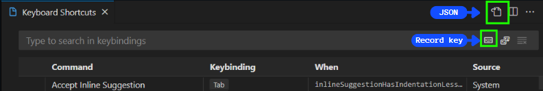

# Visual Studio Code

<!-- _Se puede colocar [Shields](https://shields.io/)_ -->

![GitHub sigueme][GitHub followers]

_Curso para el uso de Visual Studio Code_

## Tabla de contenido:
1. [Interface de usuario][1]
    * [Diseño basico][1.1]::
    * [Edición lado a lado][1.2]
    * [Minimapa][1.3]
    * [Migas de pan][1.4]
    * [Barra de actividades][1.5]
1. [Paleta de comandos][2]
1. [Métodos abreviados de teclado (Keyboard Shortcuts)][3]
    * [Raglas del teclado][3.1]
## Interface de usuario.[🔸][0]
La interface de usuario de VS Code es muy comun como otros muchos editrores de código.
### Diseño basico[🔸][0]
La interface de usuario se divide en 5 áreas:
* __Editor:__ el área principal para editar tus archivos. Puedes abrir tantos editores como desees, uno lado del otro, vertical y horizontalmente.
* __Barra lateral (Side Bar):__ contiene diferentes vistas, como el Explorador, para ayudarte mientras trabajas en tu proyecto.
* __Barra de estado (Status Bar):__ información sobre el proyecto abierto y los archivos que editas.
* __Barra de actividades (Activity Bar):__ ubicada en el extremo izquierdo, te permite cambiar entre varias vistas y te brinda indicadores adicionales especificos del contexto (extenciones), como la cantidad de cambios cuando Git está habilitado.
* __Paneles (Terminal):__ puede mostrar diferentes paneles para obtener información de salida o depuración, errores y advertencias, o un terminal integrado. El panel también se puede mover hacia la derecha para obtener más espacio vertical.

> Cada vez que se abre VS Code, se abre en el mismo estado en que se encontraba la última vez que lo cerraste.  
> La carpeta, el diseño y los archivos abiertos se conservan

    <picture>
        
    </picture>

### Edición lado a lado[🔸][0]
Para poder abrir tantos editores como desees, hay varias formas de abrir otro editor al lado del existente:
* __Alt + Clic__ en un archivo
* __Ctrl + Enter__ desde el menú contextrual del Explorador de archivos.
* Clic en el botón __Dividir editor__ en la parte superior derecha 
* Arrastra y suelta el archivo a cualquier lado de la región del editor.

>Cuando tiene más de un editor abierto, puede cambiar entre ellos con Ctrl + 1,2 ..
### Minimapa[🔸][0]
Muestra una descripción general de alto nivel de su código fuente, es util para una navegación rápida y comprención del código. El minimapa de un archivo se muestra en el lado derecho del editor. Puedes hacer clic o arrastrar el área sombreada para saltar rápidamente a diferentes secciones del archivo.

### Migas de pan[🔸][0]
El editor tiene una barra de navegación sobre su contenido llamada Breadcrumbs. Muestra la ubicación actual y te permite navegar rápidamente entre carpetas, archivos y símbolos.

<!-- ### Explorador 
### Selección multiple
### Navegación de árbol avanzada
### Vista Exterior
### Editores abiertos
### Puntos de vista -->
### Barra de actividades[🔸][0]
La barra de actividades de al izquierda te permite cambiar de entre vistas. También puedes reordenar las vistas arrastrándolas y soltándolas en la barra de actividad o eliminar una vista por completo.

## Paleta de comandos.[🔸][0]
La paleta de comandos te permite acceder a todas las funciones de Visual Studio Code,
incluidos los atajos de teclado para las operaciones más comunes. También pudes ejecutar comandos del editor, abrir archivos, buscar simbolos y ver un resumen rápido de un archivo, todo usando la misma ventana interactiva.  

---
* __Ctrl + p__: Permitira navegar a cualquier archivo o simbolo escribiendo su nombre
* __Ctrl + Tab__: Navegará a través del último conjunto de archivos abiertos
* __Ctrl + Shift + p__: Lo llevara directamente al comando del editor
* __Ctrl + Shift + o__: Permitirá navegar a un símbolo específico en un archivo.
* __Ctrl + g__: Te permitirá navegar a una línea especifica en un archivo.
* Si escribe ? en el campo de entrada podrás optener la lista de los comandos disponibles pque puede ejecuatar.

## Métodos abreviados de teclado (Keyboard Shortcuts)[🔸][0]
En VS Code proporciona la edición de _Métodos abreviados de teclado_ enriquecida y sencilla mediante el editor. Proporciona todos los comandos disponibles con y sin combinaciones de teclas y se puede eliminar, cambiar y restablecer fácilmente sus combinaciones de teclas usando las acciones disponibles. También tiene un cuadro de busqueda para encontrar el comando o las combinaciones de teclas.

Todos los atajos de teclados en VS Code se pueden personalizar a través del archivo __JSON__, en el editor de _Métodos abreviados de teclado_ selecciona __Abrir métodos abreviados de teclado (JSON)__. Esto abrirá __ `keybindings.json` archivo donde podrás sobrescribir los __atajos de teclado__

También puedes abrir  `keybindings.json` desde la Paleta de comando, para poder sobre escribir los atajos de teclado.
### Raglas del teclado[🔸][0]
Cada regla consta de:
* `key` que describe las teclas presionadas.
* `command` que contiene el identificador del comando a ejecutar.
* `when`__(opcional)__ que contiene una expresión booleana que se evaluará según el __contexto__ actual.
Los acordes(dos acciones de pulsación de tecla independiente) se describen separado por las dos pulsaciones de tecla con un espacio. Por ejemplo ``Ctrl+k Ctrl+C``

>[shortcuts a6z](src/assets/keybindings.json)

## Autores ✒️[🔸][0]
**Trabajo Inicial** ⌨️ con ❤️ por [Alfonso Gónzalez Zempoalteca](https://github.com/Alfonso6z)😊

- [ ] #1
- [ ] https://github.com/octo-org/octo-repo/issues/740
- [ ] Add delight to the experience when all tasks are complete :tada:

<!-- shields -->
[GitHub followers]: https://img.shields.io/github/followers/Alfonso6z?label=Sígueme&logo=github&style=flat-square

<!-- contenido -->
[0]:#tabla-de-contenido
[1]: #interface-de-usuario
[1.1]:#diseño-basico
[1.2]:#edición-lado-a-lado
[1.3]:#minimapa
[1.4]:#migas-de-pan
[1.5]:#barra-de-actividades
[2]:#paleta-de-comandos
[3]:#métodos-abreviados-de-teclado-keyboard-shortcuts
[3.1]:#raglas-del-teclado

<!-- https://docs.github.com/es/get-started/writing-on-github/getting-started-with-writing-and-formatting-on-github/basic-writing-and-formatting-syntax -->